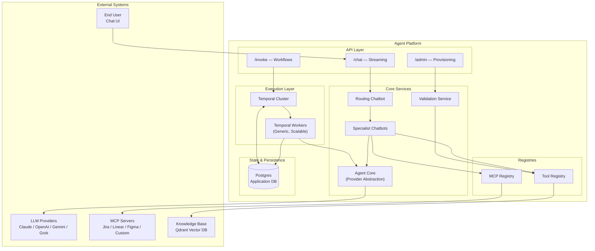
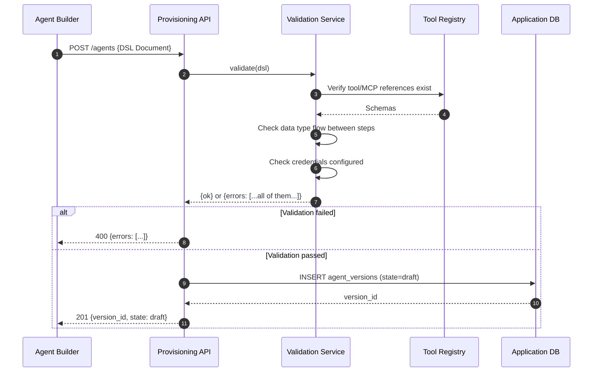
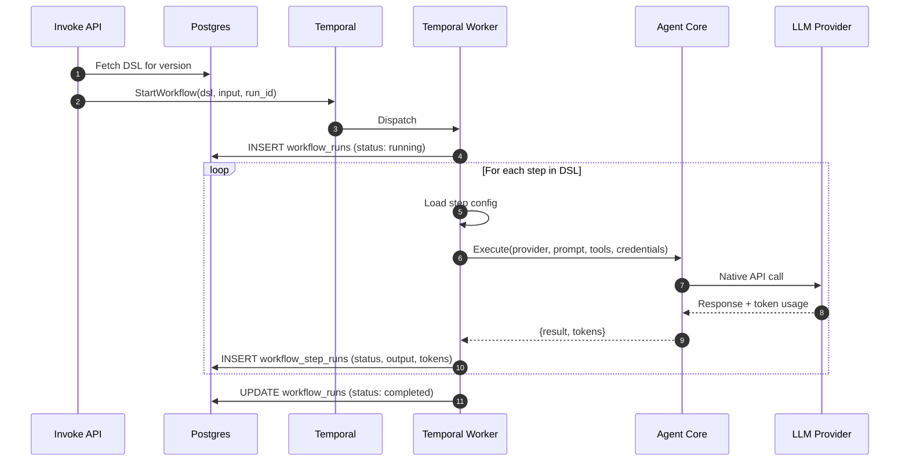
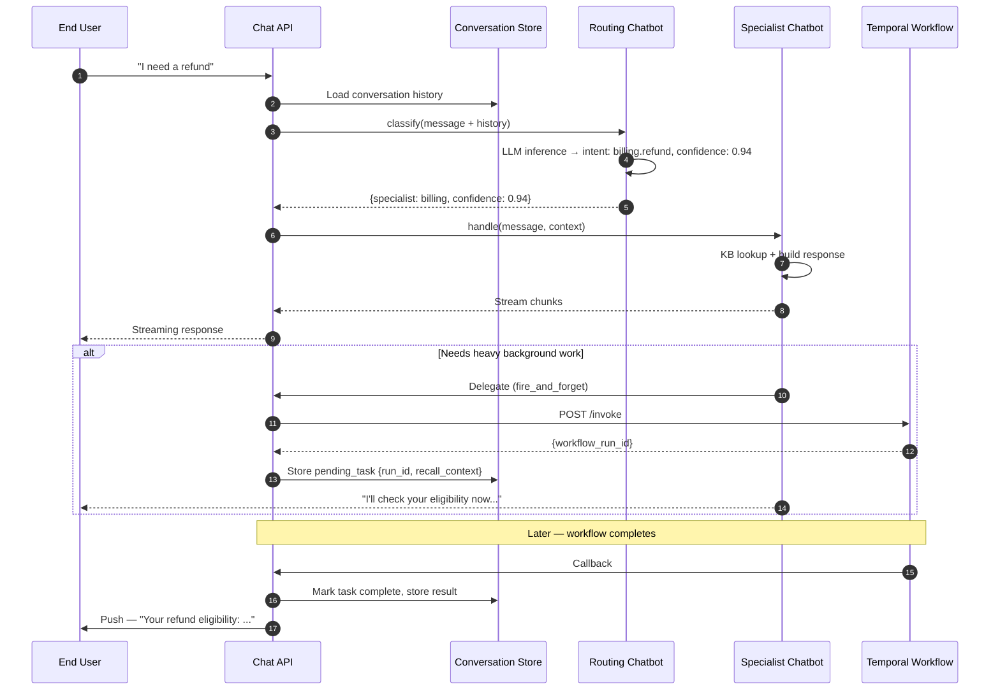
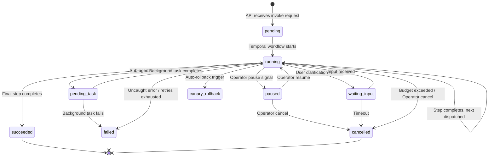
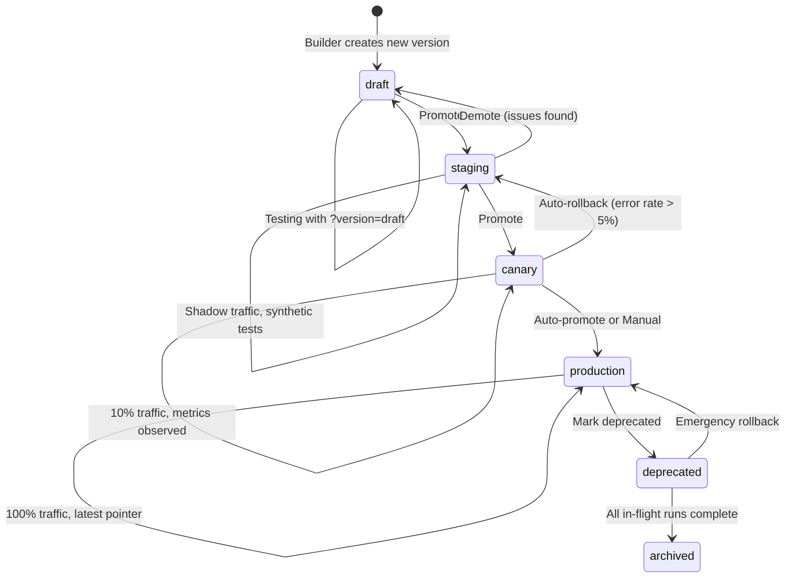
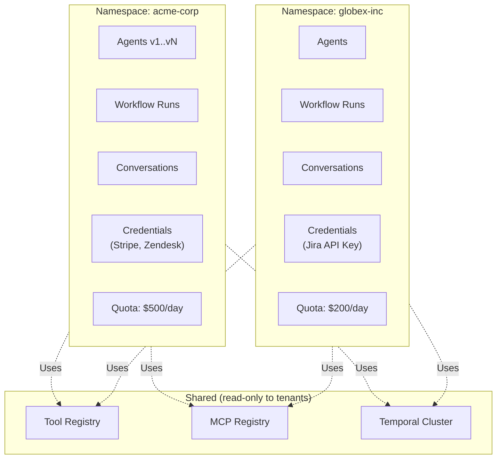
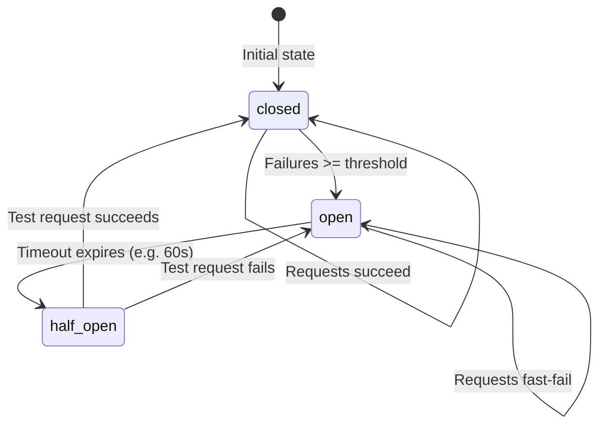
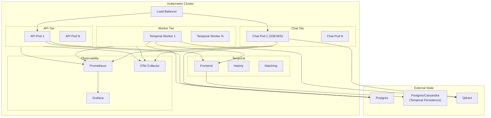

# DEEPER — How the Platform Works Under the Hood

> **TLDR**: Agents are JSON configs. A generic Temporal worker reads them at runtime and interprets each step. The Agent Core just calls the LLM. Everything else — state, retries, routing, versioning, multi-tenancy — is infrastructure built around that minimal kernel.

---

## Table of Contents

1. [System Architecture](#1-system-architecture)
2. [The DSL — What an Agent Looks Like](#2-the-dsl)
3. [Provisioning Flow](#3-provisioning-flow)
4. [Workflow Execution Flow](#4-workflow-execution-flow)
5. [Chatbot Layer & Routing](#5-chatbot-layer--routing)
6. [State Machine](#6-state-machine)
7. [Agent Version Lifecycle](#7-agent-version-lifecycle)
8. [Multi-Tenancy](#8-multi-tenancy)
9. [Circuit Breakers & Degradation](#9-circuit-breakers--degradation)
10. [Deployment Topology](#10-deployment-topology)
11. [Phased Roadmap](#11-phased-roadmap)
12. [Key Architectural Decisions (TLDR)](#12-key-architectural-decisions-tldr)

---

## 1. System Architecture



**The separation of concerns is intentional and strict:**

- The **Agent Core** only calls the LLM with a prepared bundle. It has zero knowledge of Temporal, the database, or anything else.
- The **Temporal workers** are generic — they read DSL configs from the database at runtime and interpret them. No per-agent code.
- The **Chatbot layer** is synchronous and streaming — it does NOT run through Temporal. It delegates heavy work to Temporal when needed.
- The **database** is the single source of truth for all product-visible state. Temporal's internal state is an implementation detail.

---

## 2. The DSL

> **TLDR**: Every agent is a JSON document. It declares what it is, which LLM it uses, and what steps to run. The platform interprets it — you never write orchestration code.

The DSL evolves additively across platform versions:

| DSL Version | New capabilities |
|---|---|
| v1 | Single agent: `name`, `system_prompt`, `provider`, `model_config` |
| v2 | `workflow.steps` — multi-step with data flow, retries |
| v3 | `tool_call`, `mcp_call` step types; `llm_call.tools/mcps` |
| v4 | `agent_call`, `parallel`, `for_each`, `branch`, `switch`, `while`, `until` |
| v5 | `agent_type: chatbot` with streaming-specific fields |

**Example — a multi-step workflow agent (v4 DSL):**

```json
{
  "dsl_version": "4",
  "agent_type": "workflow",
  "name": "refund-eligibility-checker",
  "namespace": "acme-corp",
  "provider": "claude",
  "model_config": {
    "model_name": "claude-3-7-sonnet-20250219",
    "max_tokens": 2048,
    "fallback_provider": {
      "provider": "openai",
      "model_name": "gpt-4o",
      "trigger_on": ["ProviderUnavailableError", "RateLimitError"]
    }
  },
  "budget": {
    "max_estimated_cost_usd": 0.50,
    "on_exceeded": "cancel_with_partial_output"
  },
  "workflow": {
    "steps": [
      {
        "id": "lookup_order",
        "type": "tool_call",
        "tool": "order_lookup",
        "inputs": { "order_id": "$.input.order_id" },
        "outputs": { "order": "object" },
        "retry": { "max_attempts": 3, "backoff_coefficient": 2.0 }
      },
      {
        "id": "check_policy",
        "type": "llm_call",
        "inputs": { "order": "$.steps.lookup_order.order" },
        "outputs": { "eligible": "boolean", "reason": "string" }
      }
    ]
  }
}
```

Key DSL mechanics:
- **Data flow** is explicit via `$.steps.<id>.<field>` and `$.input.<field>` references — no implicit state sharing.
- **Retry policy** is per-step. Different steps have different reliability profiles.
- **Budget** (`max_total_tokens` / `max_estimated_cost_usd`) is enforced mid-run by the Temporal workflow, not just at the boundary.
- **`agent_call` mode** — `wait` blocks the parent until the child completes; `fire_and_forget` spawns and proceeds immediately.

---

## 3. Provisioning Flow

> **TLDR**: POST a DSL doc. The validation service checks everything (all errors at once). On success, a new immutable version is created in `draft` state — not yet serving traffic.



**Validation rules (non-exhaustive):**
- All tool/MCP names referenced in the DSL exist in their registries
- Data types between step `outputs` and downstream step `inputs` are compatible
- `agent_call` targets exist and their input schemas are satisfied
- No cycles in sub-agent call graphs (max depth: 10)
- Provider is configured in the platform
- Credentials for all referenced tools/MCPs are present for the namespace

The validation service **collects all errors** before returning — no fail-fast. You see the full list in one shot.

---

## 4. Workflow Execution Flow

> **TLDR**: A generic Temporal worker fetches the DSL, iterates through steps, calls the Agent Core for LLM steps, and persists every step result to Postgres. Workers are stateless — Temporal handles durability.



**What the Agent Core does not know about:**
- Temporal (the orchestration layer)
- The database (it never writes)
- Retries (handled by Temporal activity configuration)
- Other steps or agents

**Credentials flow:** Loaded once at workflow start from the `CredentialsProvider` and passed as an in-memory context through all steps — no per-step DB roundtrips. In v1–v5 this reads from Postgres; in v6 the interface swaps to a secrets vault.

**Rate limiting:** A platform-level per-provider token bucket sits in front of LLM calls. The bucket serializes concurrent requests before they hit provider APIs, preventing thundering-herd re-triggering when a 429 arrives. `Retry-After` headers are honored as the authoritative wait signal.

---

## 5. Chatbot Layer & Routing

> **TLDR**: One chat window, many specialists behind it. The routing chatbot classifies each user message and forwards it. Specialists can kick off background Temporal workflows, and when those complete the chatbot proactively surfaces the result.



**Routing confidence threshold** (AD-33): If the router's `confidence` score falls below a configurable threshold (default `0.5`), it either asks the user a clarifying question (`ask_clarification`) or routes to the `default_specialist` — no silent misrouting.

**Conversation memory** (AD-30) has three tiers:
- **Working memory** — active turn context window (sliding window, summarize, or semantic retrieval strategy)
- **Episodic memory** — past session summaries stored in Qdrant, retrieved per user
- **Semantic memory** — structured user profile facts in Postgres (`user_profiles` table)

---

## 6. State Machine

> **TLDR**: Every workflow run has a lifecycle in Postgres. Temporal manages execution; the database is the product-visible source of truth.



**Pause/resume** works via Temporal signals delivered at safe checkpoints between steps. **Debug mode** — a flag set at workflow start — requires manual operator approval for each step transition before the next one executes.

---

## 7. Agent Version Lifecycle

> **TLDR**: Creating a version does not serve traffic. Versions must be explicitly promoted through gates. Canary traffic splitting and auto-rollback are built-in.



**Immutability contract (AD-16):** Every version is a permanent record. In-flight workflows are pinned to their original version. The `latest` pointer per agent is the only thing that moves.

**Auto-rollback trigger:** Canary phase tracks error rate. If it exceeds the namespace-configured threshold within the observation window, the `latest` pointer is rewound to the previous production version automatically.

---

## 8. Multi-Tenancy

> **TLDR**: Everything belongs to a namespace. Total isolation — no cross-namespace queries, credentials, or quota sharing. A `DEFAULT` namespace makes single-tenant deployments transparent.



`namespace_id` is on every table from v1. API tokens are namespace-scoped. Platform Admins hold a super-token spanning all namespaces. There is no retrofit — multi-tenancy is structural, not bolted on.

---

## 9. Circuit Breakers & Degradation

> **TLDR**: Each specialist chatbot and the knowledge base have independent circuit breakers. A flapping specialist does not take down the whole chatbot system.



**Degradation hierarchy:**
1. Specialist circuit open → routing chatbot routes to `default_specialist`
2. All specialists unavailable → routing chatbot returns `static_fallback_message`
3. KB circuit open → specialist responds without knowledge base context

Circuit state is tracked in-process per namespace and exposed via API and Operator CLI.

---

## 10. Deployment Topology



Workers are stateless generic Kubernetes `Deployment` pods — scale horizontally by workload. No per-agent infrastructure. The Temporal cluster handles durability and worker assignment.

---

## 11. Phased Roadmap

| Version | Theme | What it delivers |
|---|---|---|
| **v1** | Agent Provisioning Foundation | DSL v1, validation service, provider-agnostic Agent Core, sync invocation, Postgres state skeleton |
| **v2** | Workflow Orchestration | Multi-step DSL, Temporal worker, per-step persistence, polling orchestrator |
| **v3** | Tools & MCPs | Tool registry (code-registered), MCP registry (config-registered), credentials pipeline abstraction |
| **v4** | Multi-Agent Orchestration | `agent_call` (sync/fire-and-forget), parallel, for_each, branch, switch, while, until |
| **v5** | Chatbot Layer | Streaming endpoints, routing chatbot, specialists, KB integration, async background task surfacing |
| **v6** | Versioning & Hardening | Version promotion lifecycle, pause/resume/debug, Prometheus + OTel, vault migration, Operator CLI |
| **v7+** | Advanced Capabilities | Evaluation framework, content safety/PII, intelligent model routing, multi-agent collaboration, compliance, disaster recovery |

**v7+ themes (post-v6):**

| Phase | Documents | Focus |
|---|---|---|
| A — Quality | 27, 28, 30 | Evaluation, content safety, business intelligence |
| B — Optimization | 29, 31, 33 | Scheduling/events, intelligent model selection, KB pipeline |
| C — Capabilities | 32, 34 | Multi-agent collaboration/swarms, developer experience |
| D — Enterprise | 35, 36 | Compliance (GDPR/HIPAA), disaster recovery / multi-region |

---

## 12. Key Architectural Decisions (TLDR)

| Decision | Choice | Why |
|---|---|---|
| **AD-01** Orchestration | Temporal | Durability, retries, parallelism — not reinventable |
| **AD-02** Config format | JSON for MVP | Parseable immediately; custom DSL when real usage shows the shape |
| **AD-03** Execution model | Dynamic interpretation | Code generation would require deploy per agent change |
| **AD-04** State of truth | Application Postgres | Product-visible state must be queryable independently of Temporal internals |
| **AD-05** Orchestrator | Polling (no event bus) | Simpler; acceptable latency; additive to add bus later |
| **AD-09** LLM interface | Per-provider native tool-calling | Preserves best behavior per provider; no reinvented cross-provider format |
| **AD-10** Agent Core | Minimal, no side effects | Must stay unit-testable; all complexity lives outside it |
| **AD-16** Versioning | Immutable | In-flight workflows must not break when definitions change |
| **AD-19** Chatbot execution | Synchronous, NOT Temporal | Streaming latency and Temporal latency are incompatible |
| **AD-26** Multi-tenancy | From v1, structural | Retrofitting namespace isolation post-v6 would require breaking schema migrations |
| **AD-28** Rate limiting | Platform token bucket | Per-activity retry causes thundering-herd; shared bucket prevents it |
| **AD-29** Version promotion | draft→staging→canary→production | No auto-promote; canary gate + auto-rollback for production safety |
| **AD-30** Conversation memory | Three tiers: working/episodic/semantic | Each has different storage, retrieval, and lifecycle; conflating them loses precision |
| **AD-31** Chatbot resilience | Per-specialist circuit breakers | Flapping specialist must not starve healthy ones |
| **AD-32** Cost safety | Per-run budget in DSL | Step-count guards do not prevent token runaway within valid structural bounds |

---

> Full specification set lives in **[docs/](./docs/)**.
> Start with **[docs/01-PRD.md](./docs/01-PRD.md)** for the complete architectural decisions log and rationale.
