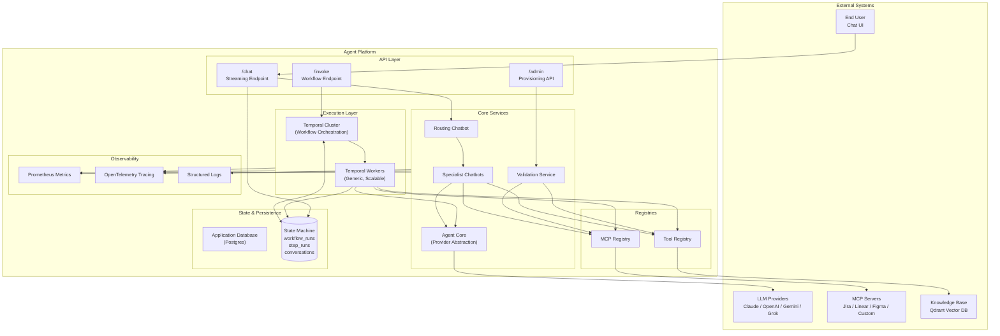
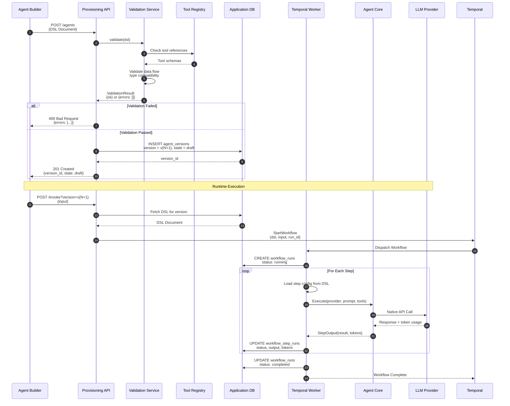
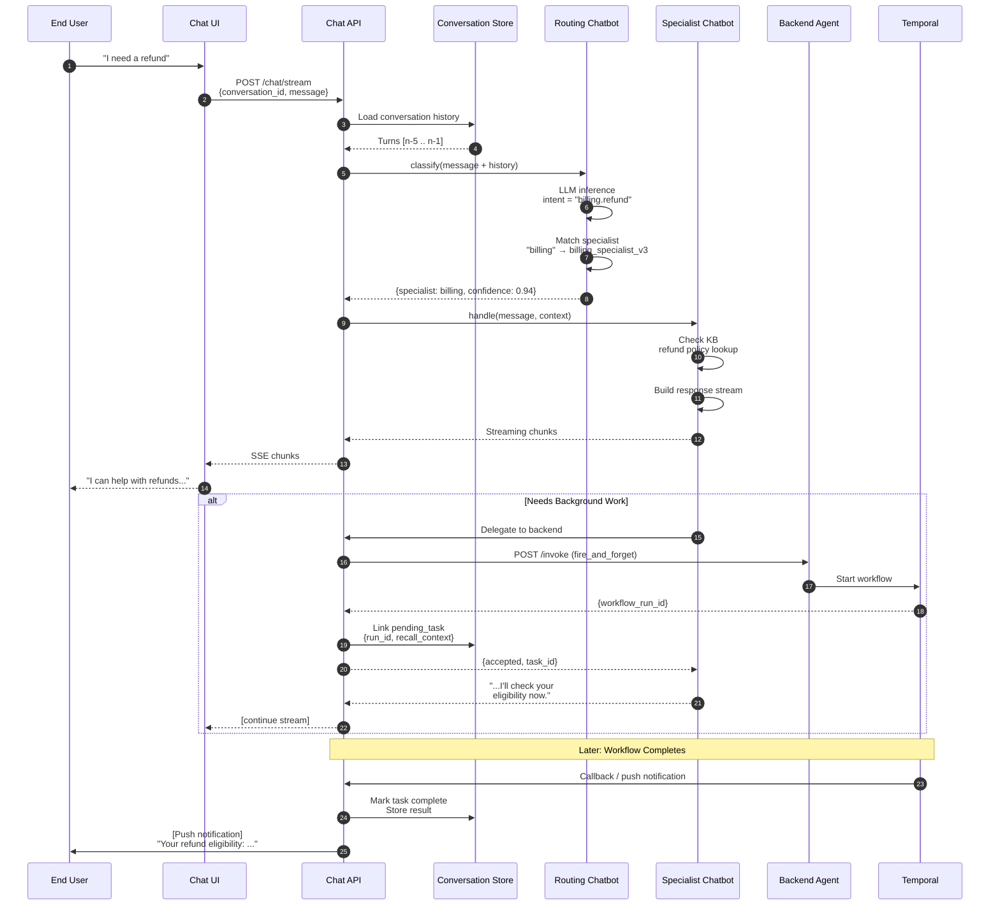
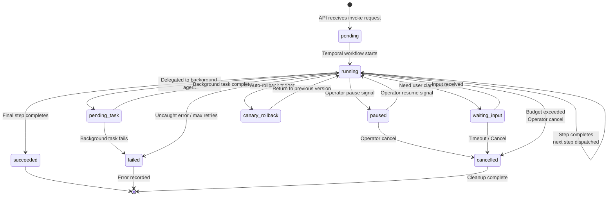
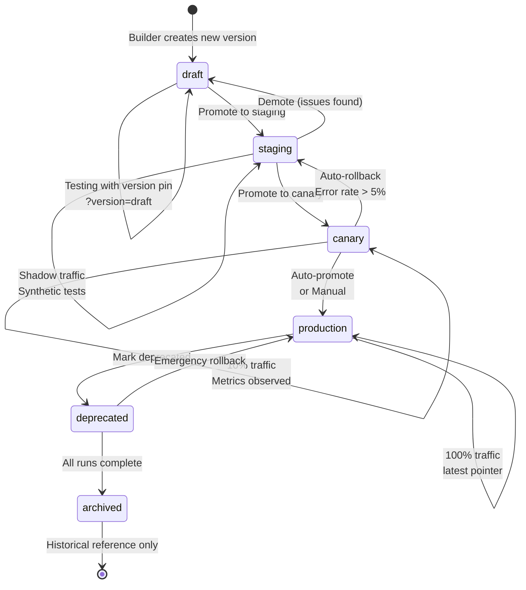
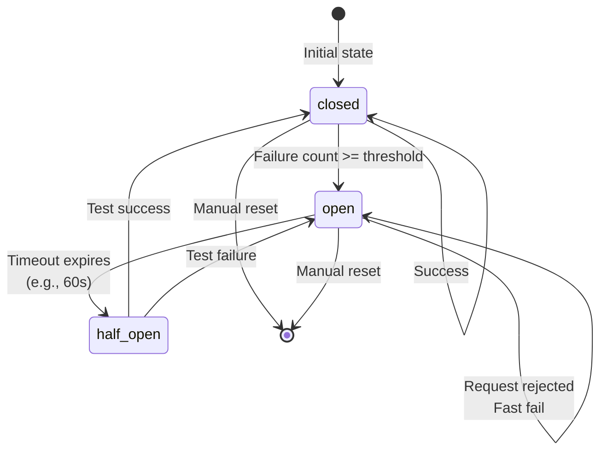

# Visual Architecture Diagrams

> **Purpose**: Visual reference for system components, data flows, and deployment topology. Complements the text specifications in `01-PRD.md` and phase documents.

---

## System Component Overview



---

## DSL to Execution Flow



---

## Chatbot Routing Flow



---

## Namespace-Based Multi-Tenancy

```mermaid
flowchart TB
    subgraph TenantA["Namespace: acme-corp"]
        A_Agents["Agent Definitions<br/>v1, v2, v3..."]
        A_Runs["Workflow Runs"]
        A_Conv["Conversations"]
        A_Creds["Credentials<br/>Stripe API Key<br/>Zendesk Token"]
        A_Quota["Daily Quota<br/>$500/day"]
    end

    subgraph TenantB["Namespace: globex-inc"]
        B_Agents["Agent Definitions"]
        B_Runs["Workflow Runs"]
        B_Conv["Conversations"]
        B_Creds["Credentials<br/>Jira API Key"]
        B_Quota["Daily Quota<br/>$200/day"]
    end

    subgraph TenantC["Namespace: default"]
        C_Agents["Agent Definitions"]
        C_Runs["Workflow Runs"]
    end

    subgraph PlatformShared["Platform Shared Resources"]
        ToolReg["Tool Registry<br/>(read-only to tenants)"]
        MCPReg["MCP Registry<br/>(read-only to tenants)"]
        Providers["Provider Configs<br/>(endpoints, rate limits)"]
        TemporalCluster["Temporal Cluster<br/>(namespaced workflow isolation)"]
    end

    TenantA -.->|Uses| ToolReg
    TenantA -.->|Uses| MCPReg
    TenantA -.->|Uses| Providers
    TenantA -.->|Runs on| TemporalCluster

    TenantB -.->|Uses| ToolReg
    TenantB -.->|Uses| MCPReg
    TenantB -.->|Uses| Providers
    TenantB -.->|Runs on| TemporalCluster

    TenantC -.->|Uses| ToolReg
    TenantC -.->|Uses| MCPReg

    Note over TenantA,TenantC: Complete isolation:<br/>• No cross-namespace queries<br/>• Separate credential scopes<br/>• Separate quota tracking
```

---

## State Machine: Workflow Run Lifecycle



---

## Version Promotion Lifecycle



---

## Deployment Topology (Kubernetes)

```mermaid
flowchart TB
    subgraph K8s["Kubernetes Cluster"]
        subgraph Ingress["Ingress Layer"]
            LB["Load Balancer<br/>SSL termination"]
        end

        subgraph APITier["API Tier (Deployment)"]
            API1["API Pod 1"]
            API2["API Pod 2"]
            API3["API Pod N"]
        end

        subgraph WorkerTier["Worker Tier (Deployment)"]
            W1["Temporal Worker 1"]
            W2["Temporal Worker 2"]
            W3["Temporal Worker N"]
        end

        subgraph ChatTier["Chat Tier (Deployment)"]
            C1["Chat API Pod 1<br/>WebSocket/SSE"]
            C2["Chat API Pod 2"]
        end

        subgraph Monitoring["Observability Stack"]
            Prom["Prometheus Server"]
            Grafana["Grafana Dashboards"]
            Collector["OTel Collector"]
        end

        subgraph Internal["Internal Services"]
            Validation["Validation Service"]
            TemporalSvc["Temporal Frontend"]
            TemporalMatch["Temporal Matching"]
            TemporalHistory["Temporal History"]
            TemporalWorkerMgr["Temporal Worker Service"]
        end
    end

    subgraph External["External Services"]
        Postgres["Postgres<br/>Application DB"]
        TemporalDB["Postgres/Cassandra<br/>Temporal Persistence"]
        Qdrant["Qdrant<br/>Vector DB"]
        Redis["Redis<br/>(optional: session/cache)"]
    end

    LB --> API1
    LB --> API2
    LB --> C1
    LB --> C2

    API1 --> TemporalSvc
    API2 --> TemporalSvc
    C1 --> TemporalSvc

    W1 --> TemporalWorkerMgr
    W2 --> TemporalWorkerMgr
    W3 --> TemporalWorkerMgr

    API1 --> Validation
    API2 --> Validation

    API1 --> Postgres
    W1 --> Postgres
    C1 --> Postgres

    TemporalSvc --> TemporalDB
    TemporalMatch --> TemporalDB
    TemporalHistory --> TemporalDB
    TemporalWorkerMgr --> TemporalDB

    W1 --> Qdrant
    C1 --> Qdrant

    APITier --> Prom
    WorkerTier --> Prom
    ChatTier --> Prom
    APITier --> Collector
    WorkerTier --> Collector
    ChatTier --> Collector

    Prom --> Grafana
```



---

## Circuit Breaker State Flow



---

## Document Index

| Diagram | Use Case | Reference |
|---------|----------|-----------|
| System Component Overview | Architecture reviews, onboarding | `01-PRD.md` §Architectural Components |
| DSL to Execution Flow | Understanding the provisioning → runtime pipeline | `02-v1` through `05-v4` |
| Chatbot Routing Flow | Chatbot layer design, UX flow | `06-v5-chatbot-layer.md` |
| Namespace Multi-Tenancy | Security reviews, tenant isolation design | `16-multi-tenancy.md` |
| Workflow Run Lifecycle | State machine implementation | `03-v2-workflow-orchestration.md` |
| Version Promotion | CI/CD integration, release process | `20-agent-version-promotion.md` |
| Deployment Topology | Infrastructure planning, SRE runbooks | `10-deployment-concepts.md` |
| Circuit Breaker | Chatbot degradation handling | `22-chatbot-degradation.md` |

---

> **Document History**
> - Created: Post-review enhancement
> - Purpose: Visual reference companion to text specifications
