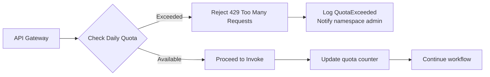

# Cost Estimation and Pricing Model

> **Purpose**: Comprehensive specification for LLM cost tracking, estimation, billing integration, and cost optimization within the Agent Platform. Extends `23-per-run-cost-cap.md` (AD-32).

---

## Cost Model Overview

The platform implements a three-tier cost control system:

| Tier | Scope | Enforcement Point | Document |
|------|-------|-------------------|----------|
| **Per-Run Budget** | Single workflow run | Temporal workflow (mid-run) | `23-per-run-cost-cap.md` (AD-32) |
| **Daily Namespace Quota** | All runs in namespace | API gateway (pre-flight) | `18-enhancements.md` (E-18) |
| **Token Pre-flight Check** | Single LLM call | Before activity dispatch | `19-provider-rate-limiting.md` |

---

## Price Table Configuration

### Platform Price Table Structure

Managed by **Platform Admin** via admin API:

```json
{
  "price_table_version": "2025-03-01",
  "effective_from": "2025-03-01T00:00:00Z",
  "providers": {
    "anthropic": {
      "claude-3-7-sonnet-20250219": {
        "input_per_1k_tokens": 0.003,
        "output_per_1k_tokens": 0.015,
        "currency": "USD"
      },
      "claude-3-opus-20240229": {
        "input_per_1k_tokens": 0.015,
        "output_per_1k_tokens": 0.075,
        "currency": "USD"
      }
    },
    "openai": {
      "gpt-4o": {
        "input_per_1k_tokens": 0.0025,
        "output_per_1k_tokens": 0.010,
        "currency": "USD"
      },
      "gpt-4o-mini": {
        "input_per_1k_tokens": 0.00015,
        "output_per_1k_tokens": 0.0006,
        "currency": "USD"
      }
    },
    "google": {
      "gemini-2.0-flash": {
        "input_per_1k_tokens": 0.0001,
        "output_per_1k_tokens": 0.0004,
        "currency": "USD"
      }
    }
  },
  "cache_discounts": {
    "prompt_caching_hit": 0.10,
    "prompt_caching_write": 1.25
  }
}
```

### Admin API: Price Table Management

```http
PUT /admin/price-table
Authorization: Bearer {platform-admin-token}
Content-Type: application/json

{
  "price_table_version": "2025-04-01",
  "providers": { ... }
}
```

**Validation rules**:
- All configured providers must have entries
- All models referenced in agent definitions must have price entries
- Price values must be positive numbers
- Currency must be supported (USD, EUR, GBP)

---

## Cost Calculation Formula

### Single LLM Call Cost

```
cost_usd = (input_tokens × input_price_per_token) + 
          (output_tokens × output_price_per_token) + 
          (cached_tokens × cache_price_adjustment)

where:
  input_price_per_token = price_table[provider][model].input_per_1k_tokens / 1000
  output_price_per_token = price_table[provider][model].output_per_1k_tokens / 1000
```

### Workflow Run Accumulated Cost

```
accumulated_cost = Σ (cost of each llm_call step) + 
                   Σ (cost of each agent_call step [wait mode only])

Note: fire_and_forget child workflows are tracked separately
```

### Chat Conversation Cost

```
conversation_cost = Σ (cost of each turn) + 
                    Σ (cost of background workflow agents triggered)
```

---

## Real-Time Cost Tracking

### Workflow Variable: Budget State

As specified in `23-per-run-cost-cap.md`, the Temporal workflow maintains:

```json
{
  "accumulated_tokens": 45312,
  "accumulated_cost_usd": 1.2345,
  "last_checked_after_step": "research_step_3",
  "cap_exceeded_at_step": null,
  "price_table_version": "2025-03-01"
}
```

### Query API for Operators

```http
GET /namespaces/{ns}/workflow-runs/{run_id}/budget-status
Authorization: Bearer {operator-token}

Response:
{
  "workflow_run_id": "uuid",
  "budget_declared": {
    "max_total_tokens": 200000,
    "max_estimated_cost_usd": 5.00
  },
  "current_consumption": {
    "accumulated_tokens": 45312,
    "accumulated_cost_usd": 1.23,
    "percent_of_token_cap": 22.7,
    "percent_of_cost_cap": 24.6
  },
  "step_breakdown": [
    {
      "step_id": "extract_entities",
      "provider": "anthropic",
      "model": "claude-3-7-sonnet-20250219",
      "input_tokens": 2048,
      "output_tokens": 512,
      "cost_usd": 0.0138
    }
  ],
  "projected_final_cost": 2.45
}
```

---

## Cost Estimation API

### Pre-Invocation Cost Estimate

Allows Agent Builders to estimate cost before running:

```http
POST /namespaces/{ns}/agents/{agent_id}/estimate-cost
Authorization: Bearer {agent-builder-token}
Content-Type: application/json

{
  "input": {
    "user_question": "Analyze our Q4 financial reports"
  },
  "estimated_steps": 5,
  "estimated_avg_tokens_per_step": 2000
}

Response:
{
  "estimate": {
    "min_tokens": 8000,
    "max_tokens": 15000,
    "expected_tokens": 10000,
    "estimated_cost_usd_min": 0.03,
    "estimated_cost_usd_max": 0.12,
    "estimated_cost_usd_expected": 0.045
  },
  "model_pricing_used": {
    "provider": "anthropic",
    "model": "claude-3-7-sonnet-20250219",
    "input_per_1k": 0.003,
    "output_per_1k": 0.015
  },
  "assumptions": [
    "Based on average 2 turns per LLM call",
    "Does not include tool call overhead",
    "Cache hits not accounted for"
  ]
}
```

### Budget Alert Webhooks

Namespace-level configuration for cost alerts:

```json
{
  "budget_alerts": {
    "webhook_url": "https://alerts.globex.com/agent-platform",
    "thresholds": [
      { "type": "daily_quota", "percent": 80 },
      { "type": "per_run", "percent": 90 },
      { "type": "anomaly", "description": "3x normal run cost" }
    ]
  }
}
```

---

## Namespace Quota System (E-18)

### Daily Quota Configuration

```json
{
  "namespace": "globex-inc",
  "daily_quota": {
    "max_cost_usd": 500.00,
    "max_tokens": 5000000,
    "max_runs": 10000,
    "timezone": "America/New_York",
    "reset_hour": 0
  },
  "alert_thresholds": {
    "warning_at_percent": 75,
    "critical_at_percent": 90
  }
}
```

### Quota Enforcement



### Quota Status Endpoint

```http
GET /namespaces/{ns}/quota-status
Authorization: Bearer {namespace-admin-token}

Response:
{
  "namespace": "globex-inc",
  "period": {
    "start": "2025-03-15T00:00:00-04:00",
    "end": "2025-03-15T23:59:59-04:00",
    "timezone": "America/New_York"
  },
  "limits": {
    "daily_cost_usd": 500.00,
    "daily_tokens": 5000000,
    "daily_runs": 10000
  },
  "consumed": {
    "cost_usd": 345.67,
    "tokens": 2345678,
    "runs": 5432
  },
  "remaining": {
    "cost_usd": 154.33,
    "tokens": 2654322,
    "runs": 4568
  },
  "percent_consumed": {
    "cost": 69.1,
    "tokens": 46.9,
    "runs": 54.3
  },
  "projected_daily_total": {
    "cost_usd": 412.50,
    "within_quota": true
  }
}
```

---

## Billing Integration

### Invoice Line Item Structure

For integration with external billing systems:

```json
{
  "invoice_period": "2025-03-01/2025-03-31",
  "namespace": "globex-inc",
  "line_items": [
    {
      "category": "llm_usage",
      "provider": "anthropic",
      "model": "claude-3-7-sonnet-20250219",
      "input_tokens": 12345678,
      "output_tokens": 3456789,
      "cost_usd": 88.89,
      "runs": 5234
    },
    {
      "category": "llm_usage",
      "provider": "openai",
      "model": "gpt-4o",
      "input_tokens": 5678901,
      "output_tokens": 1234567,
      "cost_usd": 26.45,
      "runs": 3456
    },
    {
      "category": "storage",
      "description": "Conversation history retention",
      "gb_months": 45.2,
      "cost_usd": 2.26
    },
    {
      "category": "platform_fee",
      "description": "Base platform usage",
      "cost_usd": 99.00
    }
  ],
  "total_cost_usd": 216.60
}
```

### Billing Export API

```http
GET /admin/billing-export?period=2025-03&format=csv
Authorization: Bearer {platform-admin-token}

# CSV columns:
# namespace,date,provider,model,input_tokens,output_tokens,cost_usd,run_count
```

---

## Cost Optimization Features

### 1. Intelligent Model Selection (Doc 31)

Dynamic routing to cheaper models for simpler tasks:

```json
{
  "model_selection_strategy": {
    "default": "claude-3-7-sonnet-20250219",
    "routing_rules": [
      {
        "condition": "input_length < 500 && complexity_score < 0.3",
        "model": "gpt-4o-mini",
        "estimated_savings": "60%"
      }
    ]
  }
}
```

### 2. Response Caching

Cache identical prompts (with TTL):

```json
{
  "cache_config": {
    "enabled": true,
    "ttl_seconds": 3600,
    "match_fields": ["system_prompt", "user_message", "tools_hash"],
    "cache_key_strategy": "sha256"
  }
}
```

### 3. Cost-Aware Retries

Skip retries for expensive errors:

```json
{
  "retry": {
    "max_attempts": 3,
    "cost_cap_retry": {
      "skip_if_cost_exceeds_usd": 0.50,
      "reason": "Cost-prohibitive to retry"
    }
  }
}
```

---

## Prometheus Metrics

### Cost-Related Metrics

```
# Counter: Total cost by namespace and provider
agent_platform_cost_usd_total{namespace="globex",provider="anthropic"} 345.67

# Counter: Total tokens consumed
agent_platform_tokens_total{namespace="globex",provider="anthropic",type="input"} 1234567

# Histogram: Cost per workflow run
agent_platform_run_cost_usd_bucket{le="0.01"} 523
agent_platform_run_cost_usd_bucket{le="0.10"} 1234
agent_platform_run_cost_usd_bucket{le="1.00"} 3456

# Gauge: Daily quota consumption percentage
agent_platform_quota_consumed_percent{namespace="globex",resource="cost"} 69.1

# Counter: Budget cap hits
agent_platform_budget_cap_hits_total{namespace="globex",action="cancel"} 3
agent_platform_budget_cap_hits_total{namespace="globex",action="warn_and_continue"} 12
```

---

## DSL Extensions for Cost Control

### Agent-Level Budget (Existing: AD-32)

```json
{
  "budget": {
    "max_total_tokens": 200000,
    "max_estimated_cost_usd": 5.00,
    "on_exceeded": "cancel"
  }
}
```

### Step-Level Cost Hints

Optional hints for the estimation API:

```json
{
  "workflow": {
    "steps": [
      {
        "id": "complex_analysis",
        "type": "llm_call",
        "cost_hints": {
          "expected_input_tokens": 4000,
          "expected_output_tokens": 2000,
          "model_override_for_estimate": "claude-3-opus"
        }
      }
    ]
  }
}
```

---

## Related Documents

| Document | Relevance |
|----------|-----------|
| `23-per-run-cost-cap.md` | Core per-run budget mechanism (AD-32) |
| `18-enhancements.md` E-18 | Per-namespace daily quota |
| `19-provider-rate-limiting.md` | Pre-flight token checks |
| `31-intelligent-model-selection.md` | Cost optimization through model routing |
| `30-business-intelligence-analytics.md` | Cost dashboards and analytics |

---

> **Document History**
> - Created: Post-review enhancement (agreed item #10), Doc 40
> - Purpose: Complete cost tracking and billing specification
> - Extends: `23-per-run-cost-cap.md`
